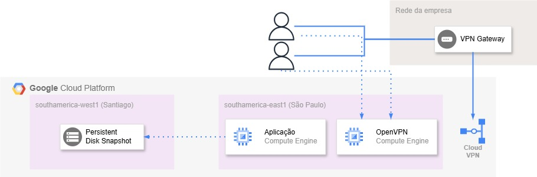

# 🛍️ Alternativa VPN Client-to-Site na GCP

## Cenário 🖼️
- Cliente já possui ambiente GCP com aplicações Cliente-Servidor rodando. Nesse caso, os usuários abrem o software executável em seu Desktop, e trabalham com seus softwares de ERP, Contábil, etc;
- Existe um túnel VPN S2S conectado da empresa do cliente até a GCP. Caso a conectividade não esteja funcional, simplesmente os softwares não funcionam;
- Quando os usuários estão no escritório, conseguem acessar os sistemas internos automaticamente por já estarem dentro da rede. Caso estejam remotos, se conectam à VPN interna da empresa (da qual automaticamente está conectada ao GCP) e conseguem acessar os sistemas da mesma forma.

## Desafios 🧗‍♂️
- Manter a conexão entre os usuários e o GCP funcional mesmo em casos de falhas e indisponibilidades;
- Otimização de custos;

## Opções 🔀
Fazer um upgrade na VPN Site-to-Site para que possua alta disponibilidade (HA).
Não é a opção mais interessante para o cenário desse cliente, pois:
- O cliente não possui outra filial além da Matriz, descartando a possibilidade de existir outro túnel em outra localidade próxima;
- O cliente preocupa-se também com a segurança física do local, visando se precaver contra incêndios ou catástrofes climáticas;

## Solução proposta 💡
Nesse cenário, o mais interessante é trabalhar com a modalidade de VPN Client-to-Site. Como o Google não possui esse serviço disponível até o momento, é possível construir a VPN Client-to-Site numa instância GCE, e configurar a VPN dentro da mesma. Considerando que o cliente desejava otimizar custos, foi configurado o OpenVPN.

- Dessa forma, é possível usar a versão community sem que haja nenhum custo, criar os usuários, e deixar o serviço de prontidão para que caso haja indisponibilidade no túnel principal, seja utilizada a contingência.

## Diagrama 🗂️

## Custos (GCP São Paulo) 💰
Custos fixo:
- Persistent Disk de 20GB = U$ 4,75
- Snapshot de 20GB = U$ 0,93
- Total de U$ 5,68

Custo diário em caso de uso ativo da VPN C2S: + U$ 6,41/Dia
